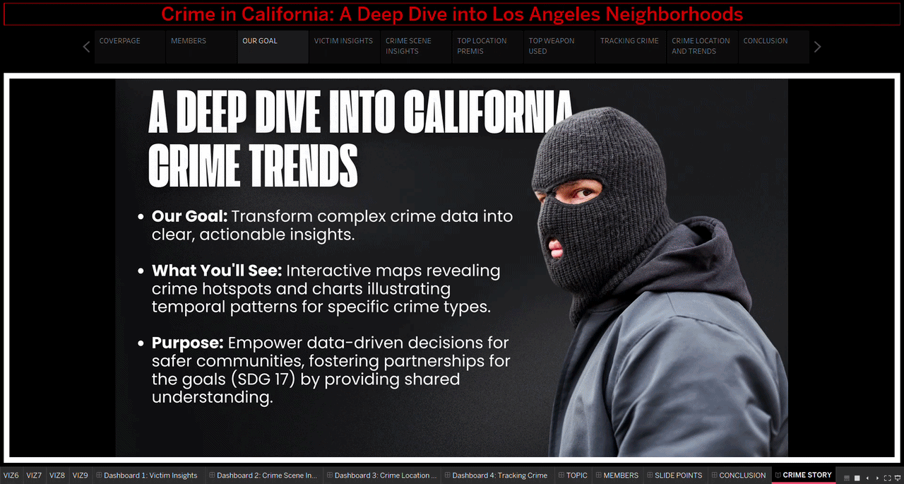
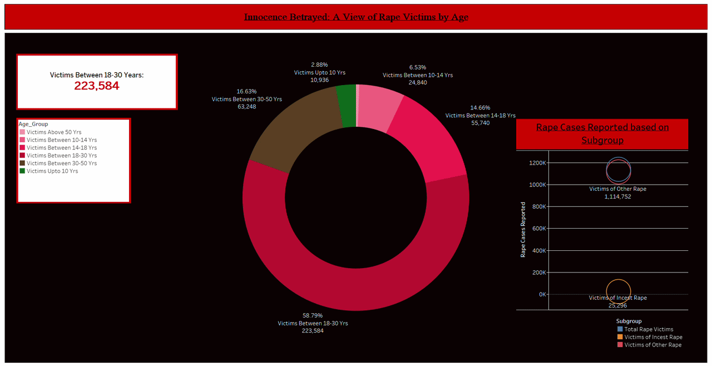

# Hi there, I'm Hanif Akmal

### Data-Driven Business Analyst | Special Innovation Award Winner (CITREX 2025)

I am a high-achieving Business Analytics student (CGPA 3.87) at **Universiti Malaysia Pahang Al-Sultan Abdullah (UMPSA)** with a passion for transforming complex datasets into actionable business insights. My expertise lies in developing AI-driven simulators and interactive dashboards to solve real-world operational and sustainability challenges.

---

### 🛠 Technical Toolbox

- **Programming:** Python (Pandas, NumPy, Scikit-learn), R, SQL
- **Data Visualization:** Tableau, Power BI, Excel (Power Query, VLOOKUP)
- **Statistical Modeling:** ARIMA, GARCH, Linear Regression, Random Forest
- **Specialized Software:** ARENA Simulation, SPSS, Wix (Web Development)
- **Languages:** English (C2 Proficient / MUET Band 4.0), Bahasa Malaysia

---

### 🎥 Interactive Dashboard Preview

  
   
  <i>Interactive session: Analyzing crime patterns and ICT literacy trends in California.</i>

  
   
  <i>Interactive session: Analyzing Rape Cases Patterns in India.</i>

### 🚀 Featured Projects

#### 🏆 [AI Re-Biz Simulator (SDG1)]
*1st Place - Special Innovation Award (CITREX 2025)*
- Led a team of four to architect an AI-based financial simulation tool using Python for predictive scenario modeling.
- Automated reporting workflows and utilized SQL for dataset management.

#### 📈 [Explainable AI in Exchange Rate Volatility](https://github.com/hnfakmal/EXPLAINABLE-AI-FOR-CURRENCY-PREDICTION)
- Implementation of XAI (SHAP) to predict and interpret currency fluctuations.
- Certified by Coventry University in Python for Finance.

#### 🌍 [Project MYHijau](https://github.com/hnfakmal/PCA-Google-Colab)
- Developed a sustainability platform for the GODAMLah 2.0 Smart ID Hackathon.
- Integrated National Smart ID systems to track and verify carbon-offset KPIs.

---

### 📊 GitHub Stats & Skills

---

### 🏅 Leadership & Activities
- **Vice President & Manager:** UMPSA Phoenix Volleyball Club (Nov 2024 - Present)
- **Team Captain:** UMPSA Phoenix Volleyball Team (Jan 2024 - Nov 2024)
- **Part-Time Mathematics Tutor:** Specialized in Calculus and Operational Research.

### 📫 Let's Connect!
- **LinkedIn:** [in/hanif-akmal](https://www.linkedin.com/in/hanif-akmal-b762b1340)
- **Email:** [hanifakmal73@gmail.com](mailto:hanifakmal73@gmail.com)

---
*"Turning data into narrative and insights into action."*
